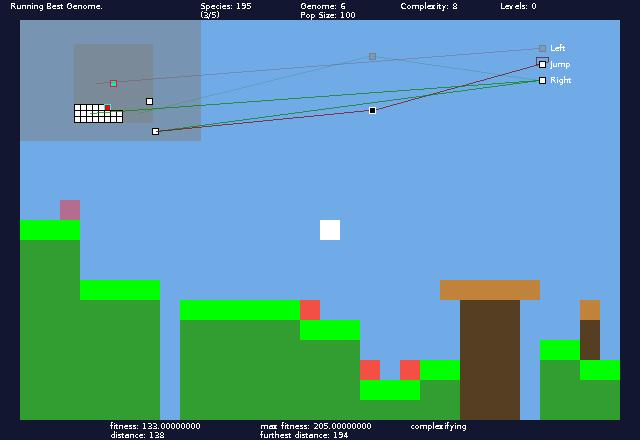

# PlatformerNeat
Uses the NEAT algorithm to evolve networks that can beat challenging platform levels.

## Getting Started
Create a project in your IDE and run Main.java to run the main application. Press 'F' to start evolving, '+' to evaluate a genome per frame, and 'T' to evaluate one generation per frame.

To play the game, use arrow keys to move and jump.

Check in Simulation.java for the rest of the controls. A more user-friendly GUI is on the todo list.
## Hacking
To change the fitness function, edit the calculateFitness() method in Simulation.java.

To change the parameters used by NEAT, edit NEATUtil.java.

To make a new type of level, edit Level.java.

Making a new kind of enemy is harder, and I'm considering rewriting most of the game-related code.
## Very WIP
Note that some of the code was made when I was 14, and a lot is being rewritten.
